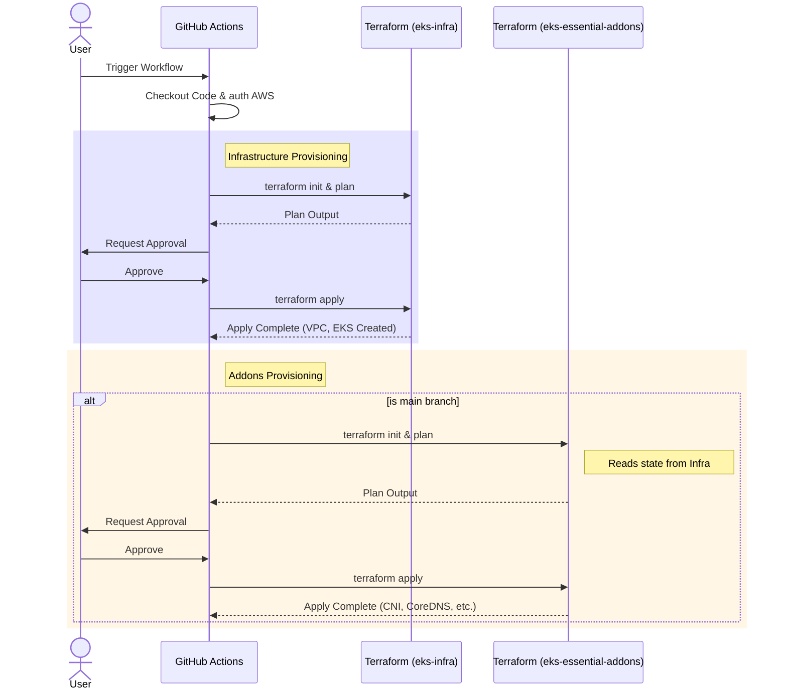

# EKS Setup

This repository contains the setup code for provisioning an Amazon EKS (Elastic Kubernetes Service) cluster and its essential addons using urukube Terraform modules. It serves as a "live" or "wrapper" repository that aggregates modular infrastructure components.

## Architecture

The project is organized into two main components, designed to be applied sequentially:

1.  **`eks-infra`**:
    - Provisions the **VPC Network** (using `terraform-module-networking`) including subnets, NAT gateways, and security groups.
    - Provisions the **EKS Cluster** (using `terraform-module-eks`) including the control plane, data plane (node groups), and IAM roles.
2.  **`eks-essential-addons`**:
    - Deploys critical Kubernetes addons to the cluster (using `terraform-module-essential-addons`), such as:
      - **VPC CNI**: For pod networking.
      - **CoreDNS**: For cluster DNS.
      - **Kube-Proxy**: Network proxy.
    - It retrieves cluster connection details from the `eks-infra` remote state.

## Deployment Workflow

The deployment is managed via a GitHub Actions workflow (`.github/workflows/main.yml`) which automates the provisioning process.

### Workflow Code Flow

1.  **Initialization**:
    - The workflow is triggered via a `workflow_call`.
    - It checks out the code and configures AWS credentials using the provided role.
    - It sets up Terraform.

2.  **Infrastructure Provisioning (`eks-infra`)**:
    - **Init & Plan**: Runs `terraform init` with the S3 backend configuration and `terraform plan` using the specified `.tfvars` file.
    - **Approval**: Pauses the workflow and waits for manual approval from the specified approvers.
    - **Apply**: Once approved, runs `terraform apply` to provision the VPC and EKS cluster.

3.  **Addons Provisioning (`eks-essential-addons`)**:
    - _Note: This step runs only on the `main` branch._
    - **Init & Plan**: Initializes and plans the addons deployment, retrieving cluster details from the infrastructure state.
    - **Approval**: Pauses for manual approval.
    - **Apply**: Applies the changes to deploy essential addons (CNI, CoreDNS, etc.).

### Sequence Diagram

### Inputs

The workflow accepts the following key inputs:

- `bucket_name`: S3 bucket for Terraform state.
- `master_s3_directory`: Prefix for the state file path.
- `tfvar_file_path`: Path to the input variables file.
- `approvers`: List of users allowed to approve the deployment.

## State Management

<!-- BEGIN_TF_DOCS -->
## Requirements

No requirements.

## Providers

No providers.

## Modules

No modules.

## Resources

No resources.

## Inputs

No inputs.

## Outputs

No outputs.
<!-- END_TF_DOCS -->
