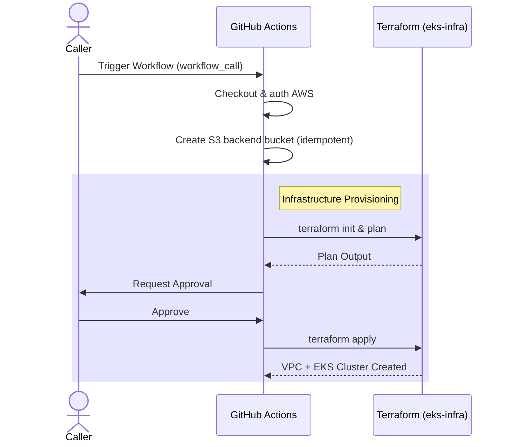

# orchestrator-plane-setup

Provisions the **Orchestrator Cluster** for the urukube IDP — the platform control plane that runs Crossplane, ArgoCD, and Backstage. It wires together the networking and EKS modules to produce a full cluster environment (VPC, EKS, IAM, IRSA) in a single apply.

See [`CLUSTER-TOPOLOGY.md`](https://github.com/urukube/.github/blob/main/.github/CLUSTER-TOPOLOGY.md) for the full platform topology and how the Orchestrator relates to BU workload clusters.

## Architecture

A single component is currently active:

- **`eks-infra`**: Provisions the full cluster environment in one apply:
  - **VPC** (via `urukube/terraform-module-networking`) — 3-tier subnets across 3 AZs, NAT gateways, VPC endpoints, security groups
  - **EKS cluster** (via `urukube/terraform-module-eks`) — control plane, self-managed node group, IAM, IRSA

> `eks-essential-addons` and `eks-custom-addons` components are planned but not yet built.

## Module Sources

| Module | Source | Version |
|---|---|---|
| networking | `urukube/terraform-module-networking` | `v1.1.1` |
| eks | `urukube/terraform-module-eks` | `v1.0.0` |

Update the `ref=` in `eks-infra/eks-infra-setup.tf` and `eks-infra/networking-setup.tf` when consuming a new release.

## Deployment Workflow

Caller repos invoke this as a reusable workflow:

```yaml
uses: urukube/orchestrator-plane-setup/.github/workflows/main.yml@main
with:
  bucket_name: my-tf-state-bucket
  master_s3_directory: my-cluster
  tfvar_file_path: ./envs/prod.tfvars
  approvers: my-github-username
```

### Flow

1. **Init** — Checks out this repo, configures AWS credentials, creates the S3 backend bucket if needed, sets up Terraform.
2. **Plan** — Runs `terraform init` + `terraform plan` for `eks-infra`.
3. **Approval** — Pauses and waits for a manual approval from the specified approvers via a GitHub issue.
4. **Apply** — Runs `terraform apply` to provision the VPC and EKS cluster.

### Sequence Diagram



### Workflow Inputs

| Input | Required | Description |
|---|---|---|
| `bucket_name` | Yes | S3 bucket for Terraform state |
| `master_s3_directory` | Yes | Prefix for the state file key |
| `tfvar_file_path` | Yes | Path to the `.tfvars` file |
| `approvers` | Yes | GitHub usernames allowed to approve |
| `module_ref` | No | Branch/tag of this repo to use (default: `main`) |

## State Management

State is stored in S3 with the key `{master_s3_directory}/eks_infra/terraform.tfstate`. The backend bucket is created automatically by the workflow before `terraform init` runs. Locking uses the native S3 lock file (`use_lockfile = true`).

## Destroy

To tear down the cluster, call the `destroy.yml` reusable workflow:

```yaml
uses: urukube/orchestrator-plane-setup/.github/workflows/destroy.yml@main
with:
  bucket_name: my-tf-state-bucket
  master_s3_directory: my-cluster
  tfvar_file_path: ./envs/prod.tfvars
  approvers: my-github-username
  component: eks_infra
```

<!-- BEGIN_TF_DOCS -->
## Requirements

| Name | Version |
|------|---------|
| <a name="requirement_terraform"></a> [terraform](#requirement\_terraform) | >= 1.5.0 |
| <a name="requirement_aws"></a> [aws](#requirement\_aws) | >= 6.42.0 |

## Providers

No providers.

## Modules

| Name | Source | Version |
|------|--------|---------|
| <a name="module_eks_infra"></a> [eks\_infra](#module\_eks\_infra) | git::https://github.com/urukube/terraform-module-eks.git | v1.1.0 |
| <a name="module_networking"></a> [networking](#module\_networking) | git::https://github.com/urukube/terraform-module-networking.git | v1.1.1 |

## Resources

No resources.

## Inputs

| Name | Description | Type | Default | Required |
|------|-------------|------|---------|:--------:|
| <a name="input_alb_access_logs_bucket_name"></a> [alb\_access\_logs\_bucket\_name](#input\_alb\_access\_logs\_bucket\_name) | S3 bucket name for ALB access logs. If null, logging is disabled | `string` | `null` | no |
| <a name="input_alb_access_logs_prefix"></a> [alb\_access\_logs\_prefix](#input\_alb\_access\_logs\_prefix) | S3 prefix for ALB access logs | `string` | `null` | no |
| <a name="input_alb_certificate_arn"></a> [alb\_certificate\_arn](#input\_alb\_certificate\_arn) | ARN of ACM certificate for HTTPS listener | `string` | `null` | no |
| <a name="input_alb_deletion_protection"></a> [alb\_deletion\_protection](#input\_alb\_deletion\_protection) | Enable deletion protection for ALB | `bool` | `true` | no |
| <a name="input_alb_http_enabled"></a> [alb\_http\_enabled](#input\_alb\_http\_enabled) | Enable HTTP listener for ALB | `bool` | `true` | no |
| <a name="input_alb_https_enabled"></a> [alb\_https\_enabled](#input\_alb\_https\_enabled) | Enable HTTPS listener for ALB | `bool` | `true` | no |
| <a name="input_alb_ingress_cidr_blocks"></a> [alb\_ingress\_cidr\_blocks](#input\_alb\_ingress\_cidr\_blocks) | List of CIDR blocks to allow ingress to ALB (HTTP/HTTPS) | `list(string)` | <pre>[<br/>  "0.0.0.0/0"<br/>]</pre> | no |
| <a name="input_alb_subnet_ids"></a> [alb\_subnet\_ids](#input\_alb\_subnet\_ids) | Subnet IDs for ALB. If not specified, uses public subnets | `list(string)` | `[]` | no |
| <a name="input_ami_type"></a> [ami\_type](#input\_ami\_type) | AMI type to use for the cluster | `string` | `"AL2023_x86_64_STANDARD"` | no |
| <a name="input_app_id"></a> [app\_id](#input\_app\_id) | application Unit | `string` | `null` | no |
| <a name="input_azs"></a> [azs](#input\_azs) | List of availability zones. If not provided, will auto-detect 2-3 AZs in the region | `list(string)` | `[]` | no |
| <a name="input_bu_id"></a> [bu\_id](#input\_bu\_id) | Business Unit | `string` | `null` | no |
| <a name="input_cloudinit_post_nodeadm"></a> [cloudinit\_post\_nodeadm](#input\_cloudinit\_post\_nodeadm) | Optional: Cloudinit post-nodeadm script to use for the cluster | <pre>list(object({<br/>    content_type = string<br/>    content      = string<br/>  }))</pre> | `[]` | no |
| <a name="input_cloudinit_pre_nodeadm"></a> [cloudinit\_pre\_nodeadm](#input\_cloudinit\_pre\_nodeadm) | Optional: Cloudinit pre-nodeadm script to use for the cluster | <pre>list(object({<br/>    content_type = string<br/>    content      = string<br/>  }))</pre> | `[]` | no |
| <a name="input_cluster_access_entries"></a> [cluster\_access\_entries](#input\_cluster\_access\_entries) | Map of cluster access entries to use for the cluster | `any` | `{}` | no |
| <a name="input_cluster_enabled_log_types"></a> [cluster\_enabled\_log\_types](#input\_cluster\_enabled\_log\_types) | List of log types to enable for the cluster | `list(string)` | <pre>[<br/>  "api",<br/>  "audit",<br/>  "authenticator",<br/>  "controllerManager",<br/>  "scheduler"<br/>]</pre> | no |
| <a name="input_cluster_endpoint_access_type"></a> [cluster\_endpoint\_access\_type](#input\_cluster\_endpoint\_access\_type) | Type of API server endpoint access:<br/>- "private": Only private endpoint (accessible only within VPC/VPN)<br/>- "private\_with\_public\_cidrs": Private endpoint + public restricted to specific CIDRs<br/>- "public": Public endpoint open to all (0.0.0.0/0), no private access | `string` | `"private"` | no |
| <a name="input_cluster_endpoint_public_access_cidrs"></a> [cluster\_endpoint\_public\_access\_cidrs](#input\_cluster\_endpoint\_public\_access\_cidrs) | List of CIDR blocks allowed to access the public API server endpoint. Required when access\_type is 'private\_with\_public\_cidrs'. | `list(string)` | `[]` | no |
| <a name="input_cluster_kubernetes_version"></a> [cluster\_kubernetes\_version](#input\_cluster\_kubernetes\_version) | Kubernetes <major>.<minor> version to use for the cluster | `string` | `"1.33"` | no |
| <a name="input_desired_size"></a> [desired\_size](#input\_desired\_size) | Desired number of nodes to use for the cluster nodes | `number` | `2` | no |
| <a name="input_eks_node_subnets"></a> [eks\_node\_subnets](#input\_eks\_node\_subnets) | List of CIDR blocks for EKS node subnets. If not provided, will auto-calculate based on VPC CIDR | `list(string)` | `[]` | no |
| <a name="input_enable_alb"></a> [enable\_alb](#input\_enable\_alb) | Create Application Load Balancer | `bool` | `false` | no |
| <a name="input_enable_dns_hostnames"></a> [enable\_dns\_hostnames](#input\_enable\_dns\_hostnames) | Enable DNS hostnames in VPC | `bool` | `true` | no |
| <a name="input_enable_dns_support"></a> [enable\_dns\_support](#input\_enable\_dns\_support) | Enable DNS support in VPC | `bool` | `true` | no |
| <a name="input_enable_flow_logs"></a> [enable\_flow\_logs](#input\_enable\_flow\_logs) | Enable VPC Flow Logs to CloudWatch | `bool` | `false` | no |
| <a name="input_enable_istio_support"></a> [enable\_istio\_support](#input\_enable\_istio\_support) | Configure security groups for Istio service mesh | `bool` | `false` | no |
| <a name="input_enable_nat_gateway"></a> [enable\_nat\_gateway](#input\_enable\_nat\_gateway) | Enable NAT Gateway for private subnets | `bool` | `true` | no |
| <a name="input_enable_network_load_balancer"></a> [enable\_network\_load\_balancer](#input\_enable\_network\_load\_balancer) | Create Network Load Balancer in public subnets | `bool` | `false` | no |
| <a name="input_enable_vpc_endpoints"></a> [enable\_vpc\_endpoints](#input\_enable\_vpc\_endpoints) | Enable VPC endpoints for AWS services | `bool` | `true` | no |
| <a name="input_enable_vpn_gateway"></a> [enable\_vpn\_gateway](#input\_enable\_vpn\_gateway) | Enable VPN Gateway | `bool` | `false` | no |
| <a name="input_env"></a> [env](#input\_env) | Environment name (dev, staging, prod) | `string` | n/a | yes |
| <a name="input_flow_logs_retention_days"></a> [flow\_logs\_retention\_days](#input\_flow\_logs\_retention\_days) | CloudWatch log retention for flow logs in days | `number` | `7` | no |
| <a name="input_friendly_name"></a> [friendly\_name](#input\_friendly\_name) | Friendly name for the cluster | `string` | `"root"` | no |
| <a name="input_iam_role_permissions_boundary"></a> [iam\_role\_permissions\_boundary](#input\_iam\_role\_permissions\_boundary) | IAM role permissions boundary to use for the cluster | `string` | `null` | no |
| <a name="input_is_eks_managed_node_group"></a> [is\_eks\_managed\_node\_group](#input\_is\_eks\_managed\_node\_group) | Boolean to enable or disable the EKS node group | `bool` | `false` | no |
| <a name="input_max_pods_per_node"></a> [max\_pods\_per\_node](#input\_max\_pods\_per\_node) | Maximum number of pods to use for the cluster nodes | `number` | `30` | no |
| <a name="input_max_size"></a> [max\_size](#input\_max\_size) | Maximum number of nodes to use for the cluster nodes | `number` | `3` | no |
| <a name="input_min_size"></a> [min\_size](#input\_min\_size) | Minimum number of nodes to use for the cluster nodes | `number` | `2` | no |
| <a name="input_nlb_access_logs_bucket_name"></a> [nlb\_access\_logs\_bucket\_name](#input\_nlb\_access\_logs\_bucket\_name) | S3 bucket name for NLB access logs. If null, logging is disabled | `string` | `null` | no |
| <a name="input_nlb_access_logs_prefix"></a> [nlb\_access\_logs\_prefix](#input\_nlb\_access\_logs\_prefix) | S3 prefix for NLB access logs | `string` | `null` | no |
| <a name="input_nlb_deletion_protection"></a> [nlb\_deletion\_protection](#input\_nlb\_deletion\_protection) | Enable deletion protection for Network Load Balancer | `bool` | `true` | no |
| <a name="input_nlb_subnet_ids"></a> [nlb\_subnet\_ids](#input\_nlb\_subnet\_ids) | Subnet IDs for NLB. If not specified, uses public subnets | `list(string)` | `[]` | no |
| <a name="input_node_instance_type"></a> [node\_instance\_type](#input\_node\_instance\_type) | Instance type to use for the cluster nodes | `string` | `"t3.medium"` | no |
| <a name="input_public_subnets"></a> [public\_subnets](#input\_public\_subnets) | List of CIDR blocks for public subnets. If not provided, will auto-calculate based on VPC CIDR | `list(string)` | `[]` | no |
| <a name="input_region"></a> [region](#input\_region) | AWS region | `string` | n/a | yes |
| <a name="input_single_nat_gateway"></a> [single\_nat\_gateway](#input\_single\_nat\_gateway) | Use single NAT Gateway to reduce costs (not recommended for production) | `bool` | `false` | no |
| <a name="input_tags"></a> [tags](#input\_tags) | A map of tags to add to all resources | `map(string)` | `{}` | no |
| <a name="input_vpc_cidr"></a> [vpc\_cidr](#input\_vpc\_cidr) | CIDR block for VPC | `string` | `"10.0.0.0/16"` | no |
| <a name="input_vpc_endpoints"></a> [vpc\_endpoints](#input\_vpc\_endpoints) | Map of VPC endpoints to create. Valid keys: ssm, ssmmessages, ec2messages, kms, ecr\_api, ecr\_dkr, ec2, sts, logs, s3, dynamodb | `map(bool)` | <pre>{<br/>  "dynamodb": false,<br/>  "ec2": true,<br/>  "ec2messages": true,<br/>  "ecr_api": true,<br/>  "ecr_dkr": true,<br/>  "kms": true,<br/>  "logs": true,<br/>  "s3": true,<br/>  "ssm": true,<br/>  "ssmmessages": true,<br/>  "sts": true<br/>}</pre> | no |

## Outputs

| Name | Description |
|------|-------------|
| <a name="output_cluster_certificate_authority_data"></a> [cluster\_certificate\_authority\_data](#output\_cluster\_certificate\_authority\_data) | The base64 encoded certificate data required to communicate with your cluster. |
| <a name="output_cluster_endpoint"></a> [cluster\_endpoint](#output\_cluster\_endpoint) | The endpoint for your EKS Kubernetes API. |
| <a name="output_cluster_name"></a> [cluster\_name](#output\_cluster\_name) | The name of the EKS cluster |
| <a name="output_cluster_oidc_issuer_url"></a> [cluster\_oidc\_issuer\_url](#output\_cluster\_oidc\_issuer\_url) | The URL of the OIDC Issuer for the EKS cluster |
| <a name="output_cluster_oidc_provider_arn"></a> [cluster\_oidc\_provider\_arn](#output\_cluster\_oidc\_provider\_arn) | The ARN of the OIDC Provider for the EKS cluster |
| <a name="output_cluster_service_cidr"></a> [cluster\_service\_cidr](#output\_cluster\_service\_cidr) | The CIDR block for Kubernetes services |
| <a name="output_vpc_id"></a> [vpc\_id](#output\_vpc\_id) | The ID of the VPC |
<!-- END_TF_DOCS -->
